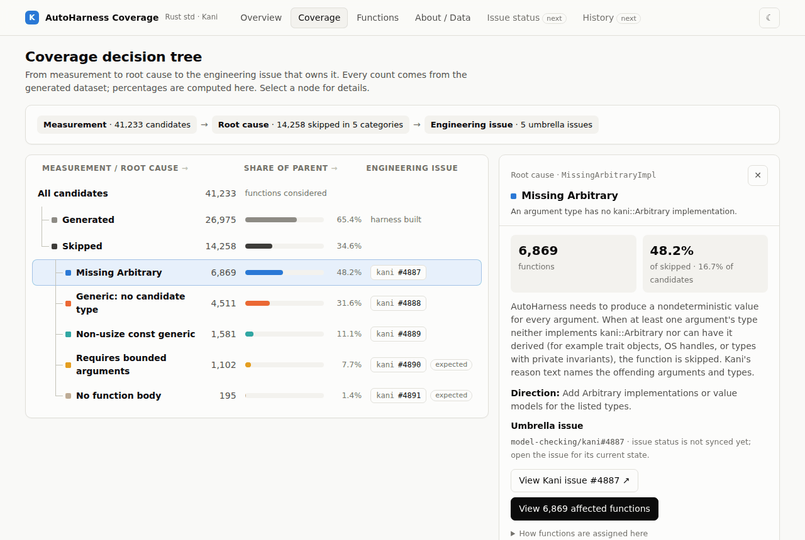
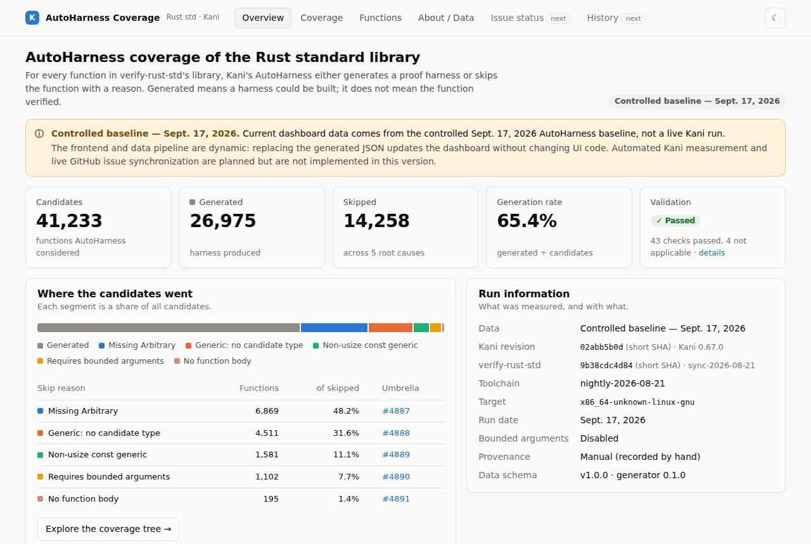
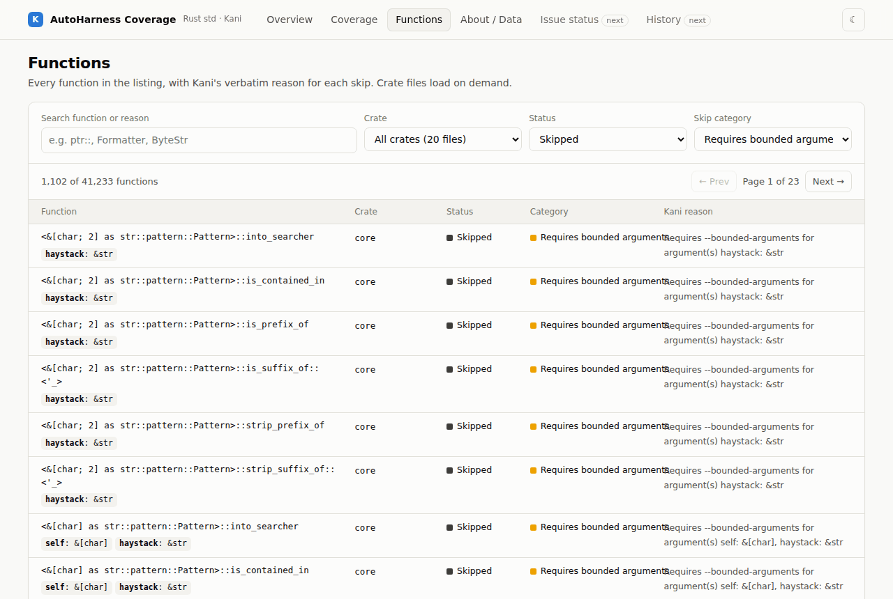
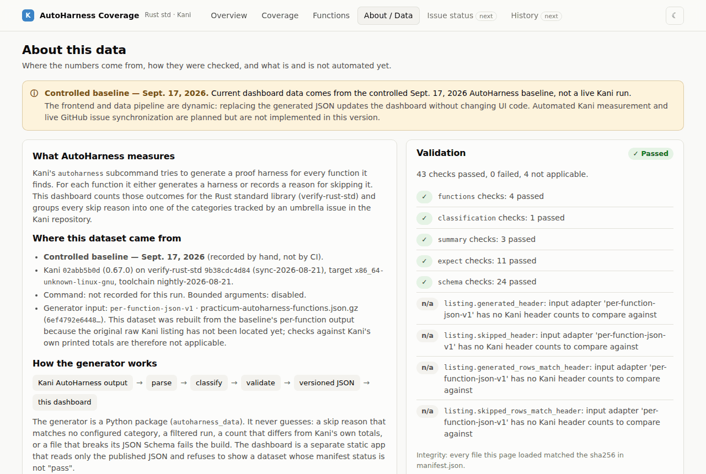

# AutoHarness Coverage Dashboard

**How much of the Rust standard library can Kani's AutoHarness generate proof harnesses for, what stops
the rest, and which Kani issue owns each blocker.**

This repository has two independent parts:

1. **A data generator** (Python). It turns Kani AutoHarness output into validated, versioned JSON.
2. **A dashboard** (React). It reads only that JSON.

Replace the JSON and the dashboard updates. No UI code changes.

> **Status: MVP.** The dashboard currently shows the **controlled Sept. 17, 2026 baseline**, not a live
> Kani run. Automated Kani measurement and live GitHub issue sync are planned (see [Roadmap](#roadmap)).

**Live dashboard:** not published yet. Publishing needs a decision about the baseline data; see
[Deployment](#deployment). To view it now, [run it locally](#run-the-dashboard) (two commands).



---

## What it shows

| View | What you learn |
|---|---|
| **Overview** | Candidates, generated, skipped, generation rate, validation status; which Kani / verify-rust-std revision was measured; breakdown by crate. |
| **Coverage** | The decision tree: *measurement → root cause → engineering issue*. Click a category for its count, share, explanation, umbrella issue, and a link to the affected functions. |
| **Functions** | All 41,233 functions, filterable by crate, status, category and text. Shows Kani's verbatim skip reason and the parsed argument types. Crate files load on demand. |
| **About / Data** | Where the data came from, every validation check, what is automated and what is not, and the sha256 of every data file. |

<details><summary>More screenshots</summary>





</details>

## Current baseline (Sept. 17, 2026)

Kani `02abb5b0d` (0.67.0, with the team's patches) on verify-rust-std `9b38cdc4d84` (`sync-2026-08-21`),
`x86_64-unknown-linux-gnu`, `nightly-2026-08-21`, without `--bounded-arguments`.

| | Functions |
|---|---:|
| Candidates | 41,233 |
| Generated | 26,975 (65.4%) |
| Skipped | 14,258 |

The dashboard computes these figures from the data; this table is for readers of the README.

### The five skip categories

Every skip Kani reports is assigned to exactly one category, each tracked by an umbrella issue under the
index [kani#4879](https://github.com/model-checking/kani/issues/4879):

| Category | Skipped | Kani reason (prefix) | Umbrella |
|---|---:|---|---|
| Missing Arbitrary | 6,869 | `Missing Arbitrary implementation for argument(s)` | [kani#4887](https://github.com/model-checking/kani/issues/4887) |
| Generic: no candidate type | 4,511 | `Generic Function: no candidate type` | [kani#4888](https://github.com/model-checking/kani/issues/4888) |
| Non-usize const generic | 1,581 | `Generic Function: non-usize const generic parameters` / `…the function has a \`const {}\` block` | [kani#4889](https://github.com/model-checking/kani/issues/4889) |
| Requires bounded arguments | 1,102 | `Requires --bounded-arguments for argument(s)` | [kani#4890](https://github.com/model-checking/kani/issues/4890) |
| No function body | 195 | `The function does not have a body` | [kani#4891](https://github.com/model-checking/kani/issues/4891) |

An unknown reason, a filtered run (`Did not match provided filters`), or
`Generic Function: not a function definition` **fails the build** instead of being guessed.
See [docs/classification.md](docs/classification.md).

## Architecture

```
 Kani AutoHarness output          (stdout of `kani autoharness --list --std`, or per-function JSON)
          │
          ▼
 Python generator  ─────────────  generator/autoharness_data/
   parse → classify → validate    (fails closed: unknown reasons, count mismatches, schema errors)
          │
          ▼
 Versioned JSON contract ───────  data/manifest.json, run.json, summary.json, categories.json,
          │                       functions/index.json, functions/<crate>.json, validation.json
          ▼
 React dashboard ───────────────  web/   (static site; refuses datasets whose manifest status ≠ "pass")
          │
          ▼
 GitHub Pages / any static host   (relative paths: works under any URL prefix)
```

The generator knows nothing about the UI, and the UI never parses Kani output. The contract between them
is JSON Schema: [docs/data-contract.md](docs/data-contract.md). Details: [docs/architecture.md](docs/architecture.md).

## Quick start

Requires **Python ≥ 3.11** and **Node ≥ 20.19** (for the dashboard).

```sh
git clone <this repository> autoharness-dashboard
cd autoharness-dashboard
git checkout feature/autoharness-dynamic-dashboard
```

### Python: install and test

```sh
python -m venv .venv
source .venv/bin/activate          # Windows: .venv\Scripts\activate
pip install -e ".[dev]"
pytest                             # ~110 tests; 1 skipped test is the pending raw-listing check
```

### Generate and verify data

```sh
# Rebuild the dashboard's dataset (the Sept. 17 baseline) into web/public/data, then verify it
scripts/build-baseline-data.sh

# From a real Kani listing (stdout of `kani autoharness -Z autoharness --list --std ./library ...`)
python -m autoharness_data build \
  --listing autoharness-list.stdout.txt \
  --run-meta run-meta.toml \
  --out data/
python -m autoharness_data verify --data data/
```

Exit codes: `0` = written and valid; `1` = validation failed (written for inspection, `manifest.json`
says `"fail"`, do not publish); `2` = input or usage error, including a missing schema validator (nothing written).

### Run the dashboard

```sh
cd web
npm install
npm run dev                        # open http://localhost:5173
npm test                           # frontend tests
npm run build                      # production build in web/dist (includes web/public/data)
```

The dashboard ships with the baseline dataset already generated in `web/public/data`, so it runs
without Python. To point it at another dataset, append `?data=<url-of-a-data-directory>` to the URL.

### Optional: make

```sh
make test     # Python tests + frontend tests
make data     # rebuild + verify web/public/data
make web      # dev server
make build    # data + production build
```

## Repository structure

```
generator/autoharness_data/     Python package (runtime dependency: jsonschema)
  adapters/                     Kani stdout table parser; per-function JSON reader
  classify.py validate.py …     classification, validation, deterministic emit
  config/categories.toml        the five categories, reason prefixes, umbrella issues
  schema/*.schema.json          the JSON contract (v1)
web/                            React + TypeScript + Vite dashboard
  src/data/                     contract types, loader (integrity + validation checks)
  src/views/                    Overview, Coverage, Functions, About
  public/data/                  bundled dataset (generated; checked by CI for drift)
fixtures/                       Sept. 17 baseline oracle; Kani test-suite tables
tests/                          Python tests (parser, classifier, validation, install, datasets)
scripts/build-baseline-data.sh  rebuild + verify the bundled dataset
docs/                           architecture, data contract, classification, development, provenance
.github/workflows/ci.yml        tests, dataset drift check, frontend build, Pages deploy
```

## Project status

| | |
|---|---|
| Parser, classification, validation, JSON contract | Done, tested |
| Dashboard (4 views, light/dark, responsive) | Done, tested |
| CI: Python + frontend tests, build, Pages deploy job | Configured |
| Sept. 17 reproduction from the **original raw Kani stdout** | **Pending**: the original file has not been located. The dataset is rebuilt from the baseline's per-function output instead. |
| Automated Kani measurement | Not started (Phase 2) |
| Live issue / PR status, history, reliability view | Not started |

## Limitations

- **The data is a fixed baseline**, not live. It measures one Kani revision on one library snapshot.
- **"Generated" does not mean "verified".** It means a harness could be built.
- **Issue links are static.** Issue and PR state is not fetched yet; open the issue to see its status.
- **`KaniImpl` skips are not counted**, because Kani leaves them out of its listing (4,563 in this run).
- The baseline's Kani and verify-rust-std revisions are known only by short SHA and included local
  workarounds, so the run can't be reproduced exactly from upstream today.
- The baseline dataset is derived from data published by a teammate's project. Keep this repository and
  any deployment private until that data is cleared for publication (see [docs/provenance.md](docs/provenance.md)).

## Roadmap

1. **Phase 2: automated measurement.** A GitHub Actions workflow runs Kani AutoHarness on verify-rust-std
   at explicit Kani / library revisions and feeds the output to this generator.
2. **Phase 3: issue and PR sync.** Curated category → umbrella → child-issue map, with titles, state, and
   linked PRs fetched from GitHub; drift warnings for unclassified issues.
3. **Phase 4: history and comparison.** Keep runs and show deltas between comparable runs
   (same `comparability_key`); reliability view for crashes, soundness and tooling issues.

## Deployment

The CI workflow tests everything and, on pushes to `feature/autoharness-dynamic-dashboard`, deploys
`web/dist` to GitHub Pages. To enable it: *Settings → Pages → Source: GitHub Actions*.

Pages on a private repository needs a paid plan, and **the published site is publicly readable** unless the
organization uses GitHub Enterprise Cloud with private Pages. See [docs/development.md](docs/development.md#deployment)
for the options.

## Contributing

See [CONTRIBUTING.md](CONTRIBUTING.md) and [docs/development.md](docs/development.md).

## License

Licensed under either of [Apache License 2.0](LICENSE-APACHE) or [MIT](LICENSE-MIT), at your option,
matching Kani and verify-rust-std. Fixture provenance: [docs/provenance.md](docs/provenance.md).
